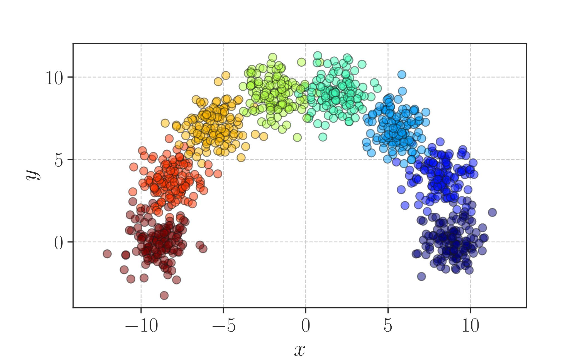

# Boltzmann Exploration Expectation-Maximisation

We present a general method for fitting finite mixture models (FMM). Learning in a mixture model consists of finding the most likely cluster assignment for each data-point, as well as finding the parameters of the clusters themselves. In many mixture models this is difficult with current learning methods, where the most common approach is to employ monotone learning algorithms e.g. the conventional expectation-maximisation algorithm. While effective, the success of any monotone algorithm is crucially dependant on good parameter initialisation, where a common choice is _K_-means initialisation, commonly employed for Gaussian mixture models.

For other types of mixture models the path to good initialisation parameters is often unclear and may require a problem specific solution. To this end, we propose a general heuristic learning algorithm that utilises Boltzmann exploration to assign each observation to a specific base distribution within the mixture model, which we call Boltzmann exploration expectation-maximisation (BEEM). With BEEM, hard assignments allow straight forward parameter learning for each base distribution by conditioning only on its assigned observations. Consequently it can be applied to mixtures of any base distribution where single component parameter learning is tractable. The stochastic learning procedure is able to escape local optima and is thus insensitive to parameter initialisation. We show competitive performance on a number of synthetic benchmark cases as well as on real-world datasets.

**Corresponding authors**:

* [Mathias Edman](mathias@kamin.ai), Kamin AI AB
* [Neil Dhir](neil@kamin.ai), Kamin AI AB

## Demo

There is no specific installation required to use BEEM. This implementation uses only bits and bobs from the standard python SciPy stack and `python 3+`. For an example of how to use it, try the [BEEM_Rainbow_demo.ipynb](BEEM_Rainbow_demo.ipynb) demo, which replicates the results from section **5.1**.

    

## Citation

If you find this repo useful in your research, please consider citing our work:

    @inproceedings{handle,
        title={}
        author={},
        booktitle={},
        year={}
    }

## License

This program is free software; you can redistribute it and/or modify it under the terms of the GNU General Public License as published by the Free Software Foundation; either version 3 of the License, or (at your option) any later version.

This program is distributed in the hope that it will be useful, but WITHOUT ANY WARRANTY; without even the implied warranty of MERCHANTABILITY or FITNESS FOR A PARTICULAR PURPOSE. See the GNU General Public License for more details.

You should have received a copy of the GNU General Public License along with this program. If not, see  <http://www.gnu.org/licenses/>.
